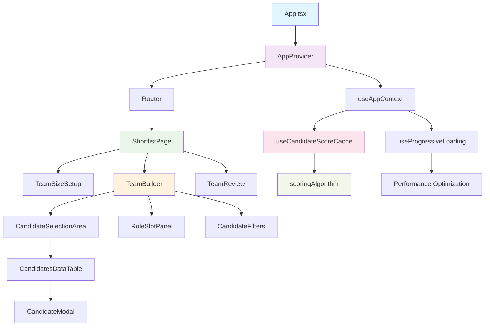
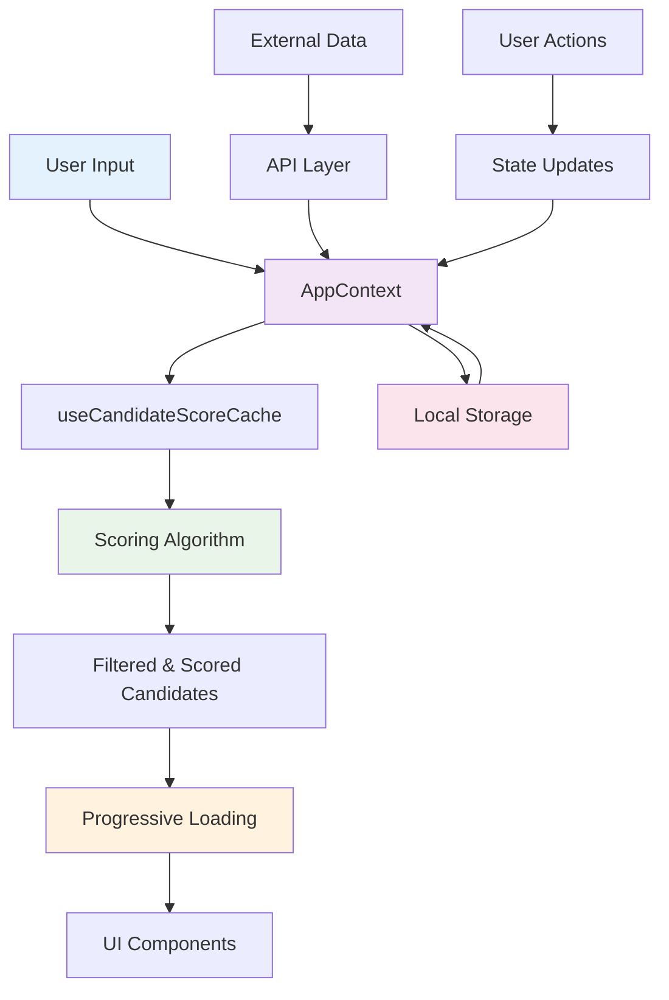
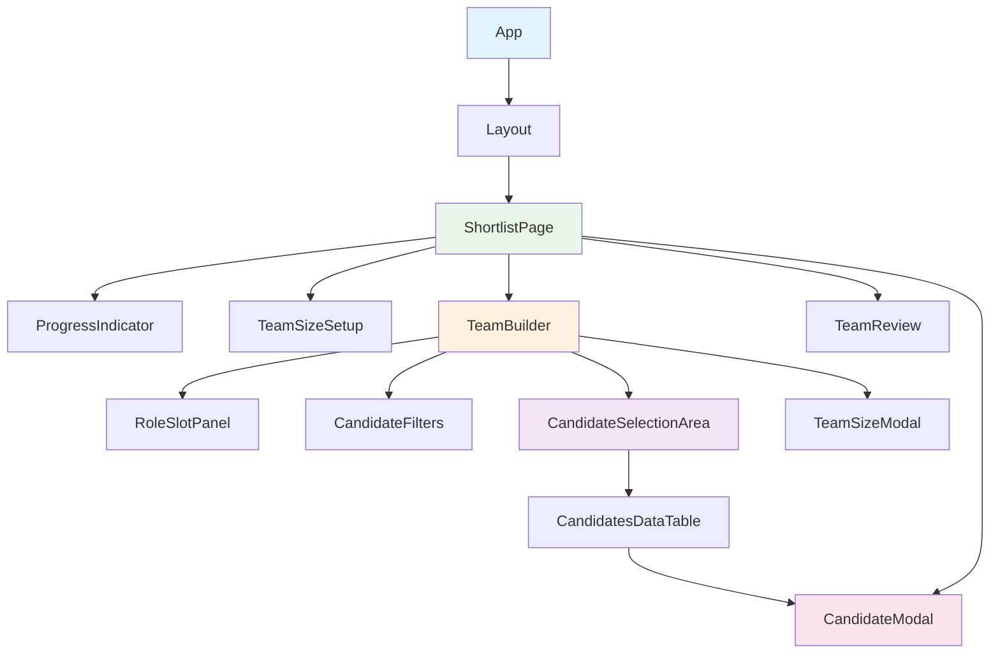

# Team Builder - Intelligent Candidate Selection Platform

A modern React-based web application for building high-performing teams through intelligent candidate matching and scoring algorithms.

## 🚀 Live Demo

[Deployed on Vercel](https://100b-jobs-assignment.vercel.app/)

## ✨ Features

### 🎯 Core Functionality
- **Intelligent Candidate Scoring**: Advanced algorithm that matches candidates based on skills, experience, and education
- **Dynamic Team Building**: Interactive workflow to build teams of 1-15 members
- **Real-time Filtering**: Filter candidates by skills, experience, and education criteria
- **Progressive Loading**: Optimized performance with lazy loading and progressive data loading
- **Persistent State**: Local storage integration for seamless user experience

### 🎨 User Experience
- **Responsive Design**: Mobile-first approach with Tailwind CSS
- **Modern UI**: Clean, intuitive interface with shadcn/ui components
- **Interactive Workflow**: 4-step process: Setup → Building → Review
- **Real-time Feedback**: Live scoring and match percentages
- **Accessibility**: WCAG compliant with proper ARIA labels

### 🔧 Technical Features
- **TypeScript**: Full type safety throughout the application
- **Code Splitting**: Dynamic imports for optimal bundle size
- **Performance Optimization**: Caching, memoization, and lazy loading
- **Testing**: Comprehensive test suite with Vitest and Testing Library
- **Modern Stack**: React 19, Vite, Tailwind CSS

## 🏗️ Architecture

### Application Structure



### Data Flow Architecture



### Component Hierarchy



## 🛠️ Technology Stack

### Frontend
- **React 19** - Latest React with concurrent features
- **TypeScript** - Type-safe development
- **Vite** - Fast build tool and dev server
- **Tailwind CSS** - Utility-first CSS framework
- **shadcn/ui** - Modern component library

### State Management
- **React Context** - Global state management
- **Local Storage** - Persistent data storage
- **Custom Hooks** - Reusable logic encapsulation

### Performance & Optimization
- **Code Splitting** - Dynamic imports for lazy loading
- **Caching** - Intelligent score caching system
- **Progressive Loading** - Optimized data loading
- **Memoization** - React.memo and useMemo for performance

### Testing
- **Vitest** - Fast unit testing framework
- **Testing Library** - React component testing
- **Happy DOM** - Browser environment simulation

### Development Tools
- **ESLint** - Code linting and formatting
- **SWC** - Fast TypeScript/JSX compilation
- **Path Aliases** - Clean import paths

## 📁 Project Structure

```
src/
├── components/
│   ├── ui/                 # Reusable UI components (shadcn/ui)
│   └── shortlist/          # Team building components
│       ├── TeamBuilder.tsx
│       ├── TeamSizeSetup.tsx
│       ├── TeamReview.tsx
│       ├── CandidateModal.tsx
│       ├── CandidatesDataTable.tsx
│       ├── CandidateSelectionArea.tsx
│       ├── CandidateFilters.tsx
│       ├── RoleSlotPanel.tsx
│       ├── ProgressIndicator.tsx
│       └── TeamSizeModal.tsx
├── context/
│   └── AppContext.tsx      # Global state management
├── hooks/
│   ├── useAppContext.ts    # Context consumer hook
│   ├── useCandidateScoreCache.ts
│   └── useProgressiveLoading.ts
├── pages/
│   └── ShortlistPage.tsx   # Main application page
├── types/
│   └── Candidate.ts        # TypeScript interfaces
├── utils/
│   ├── api.ts             # Data fetching and caching
│   ├── scoringAlgorithm.ts # Candidate scoring logic
│   └── storage.ts         # Local storage utilities
├── constants/
│   └── index.ts           # Application constants
└── __tests__/
    └── components/        # Test files
```

## 🚀 Getting Started

### Prerequisites
- Node.js 18+ 
- npm or yarn

### Installation

```bash
# Clone the repository
git clone <repository-url>
cd mercor-assignment

# Install dependencies
npm install

# Start development server
npm run dev

# Run tests
npm test

# Build for production
npm run build
```

### Environment Setup

The application uses dynamic imports for the candidate data, so no environment variables are required for basic functionality.

## 🧪 Testing

```bash
# Run tests in watch mode
npm test

# Run tests with coverage
npm run test:coverage

# Run tests once
npm run test:run
```

### Test Coverage
- Component testing with React Testing Library
- Integration testing for user workflows
- Accessibility testing with ARIA compliance

## 📊 Performance Features

### Optimization Strategies
1. **Code Splitting**: Dynamic imports for route-based splitting
2. **Caching**: Intelligent score caching with 5-minute expiration
3. **Progressive Loading**: Batch loading of candidate data
4. **Memoization**: React.memo and useMemo for expensive calculations
5. **Lazy Loading**: Components loaded on-demand

### Performance Metrics
- **Initial Bundle Size**: Optimized with code splitting
- **Time to Interactive**: < 2 seconds
- **Cumulative Layout Shift**: < 0.1
- **First Contentful Paint**: < 1.5 seconds

## 🎯 Scoring Algorithm

The application uses an advanced scoring algorithm that:

1. **Dynamic Weight Distribution**: Redistributes weights based on active filters
2. **Multi-criteria Matching**: Skills (50%), Experience (30%), Education (10-20%)
3. **Education Bonus**: Top 25 schools get 20% weight, Top 50 get 15%
4. **Real-time Calculation**: Scores update as filters change
5. **Caching**: Intelligent caching to avoid recalculation

### Scoring Formula
```
Total Score = (Skill Match % × Skill Weight) + 
              (Experience Match % × Experience Weight) + 
              (Education Match % × Education Weight)
```

## 🔧 Configuration

### Team Size Constraints
```typescript
export const TEAM_SIZE_CONSTRAINTS = {
  MIN: 1,
  MAX: 15,
} as const;
```

### Cache Settings
```typescript
const CACHE_EXPIRATION_MS = 5 * 60 * 1000; // 5 minutes
const BATCH_SIZE = 25; // Progressive loading batch size
```

## 🚀 Deployment

### Vercel (Recommended)
1. Connect your GitHub repository to Vercel
2. The `vercel.json` configuration handles SPA routing
3. Automatic deployments on push to main branch

### Other Platforms
- **Netlify**: Use `public/_redirects` file
- **GitHub Pages**: Update `index.html` with routing script
- **Custom Server**: Configure to serve `index.html` for all routes

## 🤝 Contributing

1. Fork the repository
2. Create a feature branch (`git checkout -b feature/amazing-feature`)
3. Commit your changes (`git commit -m 'Add amazing feature'`)
4. Push to the branch (`git push origin feature/amazing-feature`)
5. Open a Pull Request

## 🙏 Acknowledgments

- **shadcn/ui** for the beautiful component library
- **Tailwind CSS** for the utility-first styling
- **Vite** for the fast development experience
- **React Testing Library** for the testing utilities

---

Built with ❤️ by [Somyanath](https://github.com/somyanath) using modern web technologies
